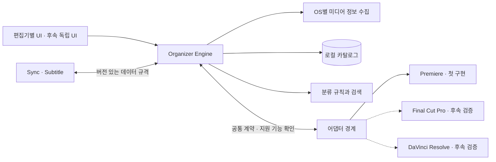

# 2. Media Organizer — 기능·설계 초안

작성일: 2026-10-03

2026-10-07 구현 현황: 사용자가 첫 엔진 계획의 직접 구현을 선택해 공통 엔진과 자동 테스트를 구현했다. 아래 설계 중 실제 Premiere·SQLite·provider 연결은 후속 범위다. [검증 기록](../../research/2026-10-07-media-organizer-validation.md).

상태: 검토용 설계. 2026-10-03 사용자 보완: 현재는 Premiere를 우선하되 다른 편집기용 버전까지 고려하고, GitHub의 기존 코드를 최대한 활용한다. 지정 저장소의 플랫폼 설계와 최신 개발 브랜치를 확인해 통합·재사용 기준을 보완했다. 새 세부 규격의 검토와 Media 제품 구현·실동작 검증은 남아 있다.

2026-10-03 후속: [공통 엔진 구현 계획](../plans/2026-10-03-media-organizer-engine.md)을 작성했다. 첫 단계는 등록·분류·검색·편집기 적용 계약을 검증하고, UXP·SQLite·실제 미디어 분석·Premiere UI 연결은 후속 단계에서 완성한다. 검색은 소스를 확인한 MiniSearch를 우선 구현하고 SQLite FTS5를 호환성 검증 실패 시 대안으로 둔다. 아직 의존성 설치나 제품 구현을 완료한 상태는 아니다.

## 1. 제품의 목적과 전제

**촬영본을 편집자가 정한 규칙으로 정리하고, 필요한 클립과 구간을 찾아 사용하는 편집기로 연결하는 공통 미디어 정리 엔진. 첫 제공 버전은 Premiere용이다.**

공유 대화에서 Media Organizer의 범위는 Auto Bin, Metadata, AI Search다. 독립적으로 개발하면서 Sync·Subtitle과 공통 데이터를 사용하고, 이후 Editing Assistant의 한 모듈로 통합한다. 제품명과 공통 패키지·데이터 규격은 `Media Organizer`로 유지하고, Premiere는 첫 번째 제공 대상과 어댑터의 이름으로 사용한다.

기존 Sync 설계에 기록된 방향은 Premiere 안에서 작업하는 패널, 로컬 분석, 촬영마다 달라지는 카메라·녹음기 구성이다. 이 문서는 그 사용 흐름을 Media의 Premiere용 버전에 적용하면서, 공통 기능을 편집기와 독립시킨다. 로컬 작업 브랜치에는 Sync 문서가 있고, 사용자가 지정한 GitHub 저장소에는 플랫폼 설계와 별도 `feat/core-contracts` 브랜치의 TypeScript Core 코드가 있다. 공통 규격은 해당 저장소의 `@pea/core`를 기준으로 맞춘다.

초안의 가정은 여러 장르 공통, 편집자 한 명, 로컬 Premiere 프로젝트 한 개다. 첫 검증 환경은 Sync 문서에 기록된 macOS arm64 / Premiere 26.5.1을 후보로 삼고 구현 시작 시 다시 확인한다. 다른 OS, Team Projects·Productions의 협업 상태 및 동시 편집은 별도 검증 대상이다.

Final Cut Pro·DaVinci Resolve용 버전을 후속 확장 대상으로 고려한다. 특정 순서나 동일한 기능 지원을 약속한 것은 아니며, 해당 편집기의 연동 경로·권한·배포 방식을 확인한 뒤 범위를 정한다. 편집기의 종류, 편집기 자체의 버전, 운영체제는 각각 독립적인 호환성 축으로 관리한다.

성공은 촬영본을 찾고 정리하는 수작업이 줄어드는 것으로 판단한다. 자동 분류의 개수만 늘리는 대신, 정확한 근거가 있는 분류와 확인이 필요한 분류를 구별하고 사용자의 수정을 유지한다.

## 2. 접근 방식과 권장 선택

| 방식 | 얻는 것 | 비용·제약 | 판단 |
|---|---|---|---|
| **공통 로컬 엔진 + 편집기 어댑터, Premiere부터 제공** | 바로 쓰는 Bin 자동화와 다른 편집기·AI·Sync 확장의 기반 확보 | 공통 모델, 엔진 패키징과 호스트 연동 검증 필요 | 권장 |
| Premiere 패널에서 메타데이터와 이름만 정리 | 첫 기능을 빠르게 확인 | 대규모 인덱스·분석을 붙일 때 구조 보완 필요 | API 검증 단계에 적합 |
| 독립 미디어 관리 앱에서 AI 검색부터 | 편집기 밖의 라이브러리와 여러 프로젝트 지원 | 앱·인덱싱·모델·편집기 연결을 동시에 개발 | 독립 UI는 후속 확장 |

Adobe는 이미 Premiere의 Media Intelligence와 Search 패널에서 자연어 장면 검색을 제공한다. 따라서 제안하는 차별점은 촬영팀의 폴더·파일명 규칙, 분류 근거와 일괄 수정, 반복 적용의 안정성, Sync·Subtitle과 연결되는 데이터다. 내장 검색을 사용자 작업에 함께 활용할 수는 있지만, 공개 API로 내부 검색 결과나 인덱스를 읽을 수 있다는 전제는 두지 않는다. [Adobe Media Intelligence 안내](https://helpx.adobe.com/uk/premiere/desktop/organize-media/file-organization/media-intelligence-and-search-panel.html)

## 3. 기능 범위와 출시 단계

| 기능 | 첫 버전 v0.1 | 이후 확장 |
|---|---|---|
| 대상 수집 | 선택 클립·Bin, 사용자가 지정한 디스크 폴더 | 자동 폴더 감시·다중 프로젝트 |
| 기본 정보 | 파일명, 경로, 미디어 종류, 길이, 영상 크기, 프레임레이트, 오디오 채널, 온라인 상태 | 카메라별 확장 메타데이터 |
| 촬영 정보 | 읽을 수 있는 촬영일·카메라·씬·테이크, 폴더·파일명 규칙, 일괄 수정 | 슬레이트 OCR·촬영 로그 연동 |
| 자동 정리 | 날짜·카메라·미디어 종류의 Bin 분류, 분류안 미리보기 | 씬·테이크·촬영단위 템플릿 확장 |
| 태그와 메모 | 사용자가 입력한 태그·메모·즐겨찾기, 자동 값의 출처 표시 | 구간별 태그와 로깅 |
| 검색 | 파일명·태그·메모·메타데이터 검색, 조건 필터, 저장된 검색 조건 | 대사 검색, 의미 검색, 장면 검색 |
| 미리보기 | 대표 썸네일, Source Monitor에서 열기 | 구간 검색 결과로 이동, 필름스트립 |
| 점검 | 오프라인·읽기 실패·분류 충돌·중복 후보 표시 | 검증된 품질 분석과 원본·프록시 연결 보조 |
| Premiere 반영 | Bin 생성·항목 이동, 검증된 프로젝트 메타데이터 필드 반영 | 사용자 선택 구간의 Marker 반영 |
| 모듈 연동 | 영구 ID와 버전 있는 JSON 교환 규격 | Sync 그룹·Subtitle 전사 결과 실제 연결 |

**v0.1의 완결된 작업:** 촬영본을 등록하고, 기본 분류를 검토·수정하고, Premiere Bin에 반영한 뒤 검색으로 다시 찾는다. AI 모델, 전사 엔진, 원본 파일 이동·이름 변경, 자동 좋은 테이크 판정은 이 버전의 개발 범위에 포함하지 않는다.

v0.2에서는 구간 로깅과 Subtitle의 전사 결과를 연결한다. v0.3에서는 실제 검색 사례와 평가 자료를 확보한 뒤 한국어 의미·장면 검색을 별도로 설계한다. 버전은 작업 범위 구분이며 일정 약속이 아니다.

위 버전은 Organizer 기능의 발전 단계다. Final Cut Pro·Resolve 지원은 별도의 어댑터 개발 순서로 관리하며, AI 검색 완성에 종속시키지 않는다. v0.1부터 편집기 독립 모델과 어댑터 계약을 사용하되, 실제 제공·검증하는 어댑터는 Premiere 하나다. 아래 사용 흐름과 Bin 예시는 첫 제공 버전을 기준으로 한다.

## 4. 사용 흐름

1. **대상 선택:** `프로젝트의 선택 항목` 또는 `폴더에서 추가`를 선택한다. Bin은 하위 항목을 펼쳐 목록화한다. 선택한 프로젝트가 바뀌면 작업을 다시 확인한다.
2. **목록 확인:** 전체 수, 기존 등록 수, 새 파일 수, 오프라인·지원하지 않는 항목 수를 표시한다. 디스크 폴더는 분석만으로 Premiere에 가져오지 않는다.
3. **분석:** 빠른 기본 정보를 먼저 표시하고, 썸네일 등 추가 작업은 뒤에서 진행한다. 완료한 항목은 바로 검색할 수 있다.
4. **분류 규칙 선택:** 기본 규칙은 `촬영일 → 카메라/녹음기 → 미디어 종류`다. 구성 요소를 빼거나 순서를 바꿀 수 있다. 같은 규칙을 프로젝트 프리셋으로 저장한다.
5. **검토:** 현재 위치와 제안 위치, 바뀌는 메타데이터, 근거, 충돌을 보여준다. 다중 선택으로 카메라·날짜·태그를 고칠 수 있다.
6. **반영:** 검토한 범위에 한해 새 파일 가져오기, Bin 생성, 기존 프로젝트 항목 이동, 선택 필드 갱신을 수행한다.
7. **결과 확인:** 성공·실패·건너뜀 수를 실제 Premiere 상태와 대조한다. 실패한 작업만 재시도할 수 있다.

예시 Bin 경로는 `Media Organizer / 2026-10-03 / CAM_A / Video`다. 값이 없는 촬영일은 `촬영일 미확인`, 카메라는 `기기 미확인`으로 표시한다. 충돌 때문에 보류한 항목은 자동 이동 대상에서 빼고 확인 목록에 남긴다. 사용자가 미확인 분류를 수용하면 해당 Bin으로 보낼 수 있다.

Bin은 한 항목의 대표 분류에 쓰고, 인물·장소·주제처럼 겹칠 수 있는 분류는 태그로 관리한다. 한 클립을 여러 태그에 넣기 위해 프로젝트 항목을 복제하지 않는다. 저장된 검색 조건은 우선 Organizer 내부 기능이다.

## 5. 자동 분류의 판단 규칙

| 정보 | 처리 원칙 |
|---|---|
| 촬영일 | 사용자 지정값, 검증 가능한 촬영 메타데이터, 사용자가 설정한 폴더·파일명 규칙을 사용한다. 파일 수정일을 곧바로 촬영일로 확정하지 않는다. |
| 시간대 | 원문 시각과 시간대 유무를 함께 보관한다. 시간대가 없으면 임의로 UTC나 한국 시간으로 변환하지 않는다. 자정을 넘긴 촬영은 사용자가 촬영일로 묶을 수 있다. |
| 카메라 | 일련번호 등 식별 가능한 메타데이터 또는 사용자가 확인한 폴더 매핑을 쓴다. 같은 카메라 모델이라는 이유만으로 같은 기기로 합치지 않는다. |
| Scene·Take | 명시적 메타데이터 또는 사용자가 지정한 파일명 패턴에서 추출한다. 패턴이 없으면 숫자를 임의로 해석하지 않는다. |
| 미디어 종류 | 스트림 정보를 우선한다. 오디오 파일이라고 자동으로 현장 녹음·BGM을 구별하지 않는다. 용도는 사용자 또는 명시적 규칙으로 정한다. |
| 충돌 | 읽은 후보와 출처를 모두 남긴다. 유효한 사용자 수정값이 있으면 이를 채택하고, 그 외 서로 다른 후보는 확인 대상으로 둔다. |
| 재분석 | 자동 추출값은 갱신할 수 있지만 사용자가 잠근 값·메모·태그는 보존한다. 잠금을 해제한 필드만 자동 값으로 돌아간다. |
| 중복 | 동일 이름은 중복 증거가 아니다. 크기·지문은 후보 탐색에 쓰고, 바이트 동일 판정은 전체 해시 등 충분한 검증 후 제공한다. 후보를 자동 삭제·병합하지 않는다. |

자동 분류는 `규칙 일치`, `사용자 확인`, `정보 부족`, `충돌` 상태와 이유를 보여준다. 규칙 일치를 정답 확률로 포장한 백분율은 표시하지 않는다. AI를 추가할 때도 추천과 사용자의 확정값을 분리한다.

## 6. 패널 구성

작은 Premiere 패널에서도 쓸 수 있도록 네 개의 탭으로 나눈다.

| 탭 | 화면과 핵심 조작 |
|---|---|
| **라이브러리** | 검색창, 필터, 썸네일/목록 전환, 클립 정보, 태그·메모 일괄 수정, Source Monitor에서 열기 |
| **자동 정리** | 분류 규칙, 입력값 미리보기, 제안 Bin 트리, 변경 전후 비교, 선택 항목 반영 |
| **확인 필요** | 정보 부족·충돌·오프라인·중복 후보를 사유별로 묶고 원본 정보와 함께 수정 |
| **작업 기록** | 실행 단계, 항목별 성공·실패, 재시도, 적용 당시 변경 내역 |

클립 상세에는 `값 / 근거 / 사용자 수정 여부`를 나란히 표시한다. 예를 들어 `CAM_A / 폴더 규칙: DAY01/A / 확인됨`처럼 읽을 수 있어야 한다. 자동 정리 화면의 미리보기만으로 디스크 파일이나 Premiere 프로젝트를 수정하지 않는다.

태그의 이름·대소문자·한글 검색용 정규화는 검색 인덱스에서 처리한다. 파일 경로의 원래 표기는 별도로 보존해 실제 파일 접근에 사용한다.

## 7. 구성 요소와 데이터 흐름

| 구성 요소 | 책임 | 의존 경계 |
|---|---|---|
| Presentation / UI | 입력·검색·검토·진행 상태·취소 | 화면 상태와 작업 명령은 공유하되 첫 UI는 UXP로 구현. 편집기별 화면 코드는 교체 가능 |
| Organizer Engine | 카탈로그 등록, 분류, 검색, 편집기 독립 변경안 생성 | `@pea/core` 규격을 사용하며 Adobe SDK·UXP·편집기 객체·OS 전용 API에 의존하지 않음 |
| Media Probe | 파일·스트림·메타데이터·썸네일 추출 | 디코더와 OS 파일 접근을 감춤 |
| Catalog Store | 영구 ID, 사용자 값, 분석 결과, 검색 인덱스, 실행 기록 | 단일 저장 계층이 쓰기와 스키마 변경을 담당 |
| Editor Adapter | 대상 읽기, 지원 기능 보고, 공통 변경안의 호스트 작업 변환, 반영·재조회 | Premiere를 먼저 구현. SDK 객체와 편집기별 작업은 어댑터 내부에서 사용 |
| Analysis Provider | 후속 STT·Vision 결과를 공통 형식으로 제공 | 첫 버전에는 인터페이스 경계만 정의하고 AI 백엔드는 구현하지 않음 |

저장소 확인 후 기술 방향은 **TypeScript 공통 Core와 Organizer 엔진 + 선택적인 C++ 미디어 처리 계층**으로 정리한다. `packages/core`의 `@pea/core`가 공통 계약·시간 모델을 소유하고, `packages/media-organizer`가 분류·검색·작업 흐름을 담당한다. SQLite 저장소와 OS별 미디어 수집 구현은 교체 가능한 경계 뒤에 둔다. 초기 초안의 C++ 코어 제안은 네이티브 미디어 처리 범위로 좁히며 별도 공통 Core를 만들지 않는다.

첫 제공 버전은 UXP JavaScript 패널, 필요한 네이티브 브리지, Premiere 어댑터와 macOS 미디어 수집 구현을 결합한다. Core가 TypeScript라는 이유로 Node 런타임이나 모든 의존성을 UXP에서 그대로 실행할 수 있다고 가정하지 않는다. 공통 로직의 번들링·런타임 의존성을 확인하고 파일·DB·네이티브 호출은 호스트별 구현으로 주입한다.

Premiere용 네이티브 브리지가 필요한 경우 Adobe Hybrid SDK를 사용한다. Adobe는 Premiere 26.2부터 Hybrid 플러그인을 지원한다고 문서화했다. SDK 로딩·패키징 검증을 구현 초기 단계에 포함한다. TypeScript 공통 Core와 Organizer 로직은 Hybrid SDK 없이 검증하며, C++ 처리 계층도 Adobe 브리지와 분리해 시험한다. [Adobe Hybrid 지원 안내](https://blog.developer.adobe.com/en/publish/2026/04/uxp-hybrid-plugins-now-available-for-premiere)

다른 편집기에서 UXP 패널이나 `.uxpaddon`을 재사용한다고 가정하지 않는다. 재사용 대상은 엔진·데이터·규칙·검색·공통 화면 상태이고, UI 호스팅·호출 브리지·설치 패키지는 대상별로 정한다. OS 전용 디코더·파일 접근도 별도 구현으로 교체한다.

### 7.1 편집기 어댑터 계약

아래 이름은 우리가 정의하는 인터페이스이며 각 편집기가 동일한 API를 제공한다는 뜻은 아니다.

| 계약 | 입력·결과와 역할 |
|---|---|
| `getCapabilities(context)` | 편집기·앱 버전·OS·어댑터 버전과 작업별 `supported / unsupported / unverified` 상태, 연동 방식·제약 반환 |
| `readContext(selection)` | 선택 미디어·분류·주석·프로젝트 식별 정보를 공통 형식으로 변환. 읽을 수 없는 필드와 이유를 함께 반환 |
| `planApply(organizationPlan)` | 공통 분류안을 대상 편집기의 `HostApplyPlan`으로 변환. 직접 반영·교환 파일·수동 단계·지원 불가를 작업별로 표시 |
| `apply(hostApplyPlan)` | 지원이 확인된 작업만 실행하고 항목별 결과 기록. 교환 파일 생성은 `exported`로 기록 |
| `verify(receipt)` | 호스트 재조회 또는 확인 가능한 가져오기 결과로 실제 반영을 확인. 확인 전에는 `verified_applied`로 확정하지 않음 |
| `reveal(binding, range?)` | 가능한 경우 대상 클립·구간 열기. 지원하지 않으면 위치 정보나 실행 가능한 수동 안내 반환 |

Bin 같은 계층형 분류와 태그·키워드 기반 분류를 하나의 기능이라고 가정하지 않는다. 코어에는 `Collection`과 `Tag`를 별도로 두고 어댑터가 대상의 지원 기능에 맞게 변환한다. 손실되는 계층·태그·구간·필드가 있으면 적용 전 표시하고, 지원하지 않는 데이터는 카탈로그에 보존한다. 형식 변경이 필요한 작업은 사용자 검토 없이 의미가 다른 기능으로 대체하지 않는다.

되돌리기·원자적 처리·메타데이터 쓰기 범위도 기능별 지원 정보에 포함한다. 앱 버전이 바뀌면 해당 조합의 기능을 다시 확인하고, 확인하지 않은 기능은 지원한다고 표시하지 않는다. 다른 편집기에서 플러그인 방식이 적합하지 않다면 독립 UI와 교환 파일 방식도 선택할 수 있도록 엔진 호출을 분리한다. 구체적인 연동 방식은 후속 공식 API 조사와 실제 검증으로 확정한다.

## 8. 공통 데이터 규격

핵심은 **원본 미디어, 공통 클립, 편집기 안의 항목, 한 번의 분석 작업을 서로 다른 식별자로 관리하는 것**이다. Adobe의 ID·타임코드 타입·Bin 경로를 공통 데이터의 필수 값으로 쓰지 않는다.

| 데이터 | 주요 필드와 의미 |
|---|---|
| `ProjectCatalog` | `catalogId`, `schemaVersion`, `revision`, `hostProjectBindings` — 편집기와 독립적인 카탈로그 및 대상 프로젝트 연결 |
| `Asset` | `assetId`, `fileRevision`, `locations`, `streams`, `captureMetadata` — 원본 미디어와 현재 내용의 버전 |
| `Clip` | `clipId`, `assetId`, `sourceRange` — 편집기와 독립적으로 식별하는 원본 전체 또는 구간 |
| `HostBinding` | `bindingId`, `clipId`, `adapterId`, `hostProjectKey`, `hostItemId`, `hostRevision` — 공통 클립과 편집기 항목의 연결 |
| `Collection` / `Tag` | `collectionId`, `parentId?`, `members` / `tagId`, `assignments` — 계층 분류와 중첩 가능한 태그를 별도로 표현 |
| `MetadataValue` | `field`, `observedCandidates`, `override`, `effectiveValue` — 자동 후보와 사용자 수정값을 분리 |
| `Annotation` | `annotationId`, `assetId`, `clipId?`, `range?`, `kind`, `value`, `origin`, `reviewState` — 태그·메모·후속 전사·구간 정보 |
| `RuleSet` | `ruleSetId`, `version`, `orderedRules`, `collectionTemplate` — 재현 가능한 편집기 독립 분류 규칙 |
| `OrganizationPlan` | `planId`, `catalogRevision`, `desiredState`, `issues` — 분류·태그·주석의 목표 상태 |
| `HostApplyPlan` | `hostPlanId`, `planId`, `adapterId`, `hostProjectKey`, `capabilityRevision`, `operations`, `compatibilityReport` — 특정 대상의 적용 계획 |
| `ApplyReceipt` | `applyId`, `hostPlanId`, `operations`, `createdBindings`, `status` — 특정 대상의 적용·내보내기·재확인 결과 |

위 표의 `Asset`·`Clip`은 설명을 위한 개념명이다. 저장소 공개 계약에서는 각각 `MediaAsset`·`ClipReference`를 사용한다. 아래 저장소 매핑이 공통 계약의 이름·시간 표현·Job 상태에 우선하며, Media 전용 필드는 별도 확장 레코드로 보관한다.

`assetId`와 `clipId`는 카탈로그가 발급·보존하는 UUID다. 경로, 파일명, 해시는 그 자체로 영구 ID가 아니다. 동일 원본의 서로 다른 사용 구간이나 독립 항목은 여러 `Clip`으로 하나의 `Asset`을 참조할 수 있다. 동일한 클립을 다른 편집기로 전달한 경우에는 명시적으로 식별을 이어받아 같은 `clipId`에 별도 `HostBinding`을 추가한다. 같은 원본·구간이라는 이유만으로 기존 독립 클립을 자동 병합하지 않는다. 편집기 내부의 항목 ID는 `adapterId + hostProjectKey + hostItemId` 범위 안에서만 해석한다.

동일한 이름의 다른 파일은 별도 Asset이다. 별도 경로의 복사본은 중복 후보로 연결하되 사용자 의도를 확인하지 않고 하나의 소스로 합치지 않는다. 절대 경로는 환경별 위치 정보로 보관하고 영구 식별자로 삼지 않는다. 다른 OS나 저장소 루트로 옮길 때는 원본 ID를 유지하고 경로 매핑을 갱신한다. 플랫폼 간 대소문자·문자 정규화 차이로 애매해진 경로는 재연결 확인 대상으로 둔다.

경로 이동 뒤 재연결할 때는 기존 파일 정보와 지문을 대조하고, 애매하면 기존 연결을 유지한 채 확인을 요청한다. 파일 내용이 바뀌면 `fileRevision`을 갱신하여 관련 캐시와 자동 분석 결과를 무효화한다. 시간 구간을 포함한 사용자 주석은 보존하되 재확인 상태로 둔다.

`Annotation`의 기본 범위는 원본 미디어이며, 특정 공통 클립에만 적용하는 메모는 `clipId`를 명시한다. 편집기에서만 의미가 있는 값은 `HostBinding`의 편집기별 확장 데이터로 보관한다. 썸네일·자동 분석은 Asset 단위로 재사용하고 서브클립의 사용 범위는 Clip 단위로 유지한다. 호스트에서 읽은 값은 출처를 붙인 후보이며, 동기화 과정에서 기존 공통 사용자 값을 자동 덮어쓰지 않는다.

시간은 저장소 Core의 `MediaTime {ticks: bigint, timebase: {numerator, denominator}}`와 `TimeRange {start, duration}`을 사용한다. 원본 시작을 기준으로 구간을 해석하고 Media의 실제 사용 구간은 `0 ≤ start < start + duration ≤ mediaDuration`을 추가 검증한다. JSON에 bigint를 직접 쓰지 않고 문자열 정수 등 공통 직렬화 규약을 Core와 함께 확정한다. 촬영 타임코드와 타임라인 위치는 별도 필드다. Core의 `FrameRate`는 분자·분모와 drop-frame 표시를 보존하고 가변 프레임 정보는 Media의 분석 레코드로 유지한다.

편집기 고유 시간 단위와 원본 시작 오프셋은 어댑터에서 변환하며 반올림 오차를 기록한다. 교환 데이터는 `schemaVersion`과 생산 모듈 버전을 포함한다. 지원하지 않는 주요 스키마 버전은 변경 반영을 중단하며, 카탈로그 마이그레이션은 백업 후 실행한다. v0.1에는 다중 편집기 간 실시간 양방향 동기화를 넣지 않고, 후속 연결도 읽기·비교·검토·적용의 명시적 절차를 기본으로 한다.

기존 Sync 계획의 `SourceRef.id`와 `itemKey`는 작업·세션 단위다. 이를 영구 `clipId`로 그대로 사용하지 않는다. 연동 어댑터가 `jobId + sourceId ↔ clipId + assetId + fileRevision` 매핑을 보관하고 결과를 변환한다. Sync의 초 단위 결과는 명시된 정밀도로 공통 시간값에 변환하며 정확한 원본 타임스탬프를 새로 복원했다고 주장하지 않는다. 기존 Sync 규격을 조용히 바꾸지 않고 교환 규격에 버전을 붙인다.

### 8.1 지정 GitHub 저장소와의 통합 기준

확인한 저장소는 `plutoan12/premiere-editing-assistantt`다. 기준은 `main`의 플랫폼 설계와 `feat/core-contracts`의 코드 스냅샷 `9f2119ce55bd090c86e84b058725776a9405228c`이며, 개발 브랜치가 병합·완성됐다는 의미는 아니다. 실제 구현 전 최신 기준과 호환성을 다시 확인한다.

| Media 개념 | 저장소 기준과 연결 |
|---|---|
| Asset 식별 | `MediaAsset.id`를 재사용. 현재 Core 필드는 `id`, `uri`, `fingerprint`, `frameRate?`, `readOnly: true` |
| 클립 식별 | `ClipReference.id`, `mediaAssetId`, `sourceRange` 재사용 |
| 촬영 메타데이터·파일 버전·추가 위치 | `mediaAssetId`로 연결하는 Media 전용 분석 레코드. 공통 객체에 필드를 임의로 추가하지 않음 |
| 편집기 항목 연결 | `HostBinding`은 Core ID를 참조하며 `adapters/premiere` 등이 편집기 고유 값을 관리 |
| 시간 | Core의 `MediaTime`, `TimeRange`, `FrameRate` 사용. 별도 value/timescale 공개 규격을 만들지 않음 |
| 작업 | Core의 `Job` 사용. 부분 성공은 결과의 항목별 상태와 건수로 표현 |
| 분석 출력 | Core의 `Artifact` 수명주기와 연결하고 검증에 성공한 결과만 현재 유효 결과로 승격 |
| 미디어 수집 | 기존 `MediaProbeProvider` 경계를 재사용. 현재 반환형이 일반 레코드이므로 Media에 필요한 구조와 검증을 먼저 정의 |

현재 Core의 `fingerprint`는 필수이며 알고리즘은 `sha256`이다. 빠른 파일 목록과 부분 지문은 Media의 임시 스캔 레코드로 관리하고 완전한 검증 없이 Core의 SHA-256 필드에 넣지 않는다. 정식 Core 등록 전에 지문을 완성하거나, 선택적·단계적 지문 계약이 필요하면 공통 규격의 별도 변경으로 검토한다.

최신 개발 브랜치에는 `packages/core/src/validation.ts`와 공개 API 테스트가 추가됐다. 현재 `parseCoreDocument`는 버전 검사와 `project` 문서만 처리하므로 이 진입점을 확장해 Media 문서를 지원한다. bigint의 JSON 직렬화와 미디어 시간 범위·참조 무결성 검증이 모두 준비됐다고 가정하지 않는다. Media 구현 계획에서 필요한 계약을 명시하고 Core의 공개 규격과 함께 해결한다.

코드의 배치는 `packages/media-organizer`에 편집기 독립 로직, `adapters/premiere`에 Premiere 연동, `apps/premiere-panel`에 UI, `packages/core`·`schemas`에 합의된 공통 규격을 둔다. 특정 모듈의 사설 상태를 다른 모듈이 직접 읽지 않는다. 이 확인 작업은 저장소나 기존 Core 코드를 수정하지 않는다.

### 8.2 기존 코드 우선 활용

사용자 요구에 따라 새 기능마다 **지정 저장소의 기존 구현 → 유지보수되는 라이브러리 → 공식 예제의 필요한 부분 → 제품 전용 구현** 순서로 검토한다. 같은 역할의 타입·시간 계산·작업 상태·미디어 파서를 별도로 복제하지 않는다. 아래는 소스 확인에 따른 재사용 계획이며 이미 제품에 통합하거나 실행 검증한 결과는 아니다.

외부 코드는 함수 이름으로 실제 GitHub 코드 검색을 수행하고 해당 구현을 읽었다. 커밋·파일·함수·수정 지점은 [GitHub 구현 코드 검색 결과](../../research/2026-10-03-media-organizer-code-reuse.md)에 기록했다. 주요 확인 대상은 Adobe의 `projectPanel.ts`, `batchUpdate.js`, `import.ts`, `sourceMonitor.ts`, mediainfo.js의 `analyzeData`, MiniSearch의 색인·검색 함수, LosslessCut의 `runFfprobe`와 프레임 추출 함수다.

| 확인한 기존 코드 | Media에서 활용할 부분 | 추가로 필요한 부분 |
|---|---|---|
| `packages/core/src/media.ts`, `project.ts` | `MediaAsset`, `ClipReference`, `Project`와 Zod 스키마 | 촬영 정보·위치·사용자 수정은 ID로 연결한 별도 레코드 |
| `packages/core/src/time.ts` | `MediaTime`, `TimeRange`, `FrameRate`, `compareMediaTime` | 원본 길이 경계·직렬화·가변 프레임 입력 검증 |
| `packages/core/src/jobs.ts` | `Job`, `JobStatus`, `canTransitionJob` | 항목별 진행·실패·재시작 기록. 스케줄러가 완성됐다고 가정하지 않음 |
| `packages/core/src/artifacts.ts` | `Artifact`, `promoteArtifact` | 실제 저장·캐시·내용 검증은 별도 구현. 승격 함수가 검증 자체를 대신하지 않음 |
| `packages/core/src/analysis.ts`, `providers.ts` | `AnalysisTag`, `Provenance`, `MediaProbeProvider` | 사용자 태그의 소유 범위와 구조화된 probe 결과 검증 |
| `packages/core/src/validation.ts`, `index.ts` | 공개 import 경로와 버전 있는 파싱 진입점 | Media용 문서 종류를 공통 진입점에 확장 |
| `packages/sync` | 후속 Sync 결과 연동, 기존 전략 선택·타임코드 그룹 구성의 소유권 유지 | 현재 결과의 ticks와 공통 timebase 연결 검증. Media에서 싱크 알고리즘을 중복 구현하지 않음 |
| pnpm workspace, TypeScript, Vitest, `.github/workflows/ci.yml` | 기존 패키지·검증·CI 구성에 `@pea/media-organizer` 추가 | Media 특화 사례와 호스트 통합 테스트를 추가하고 기존 검증도 유지 |

공통 기능에 부족한 부분이 있으면 `packages/core`의 호환 가능한 확장으로 해결하고 각 모듈에 복사본을 만들지 않는다. 공통 계약을 깨는 변경은 버전·마이그레이션 영향을 명시한다. 개발 중인 브랜치는 검토한 커밋을 기준으로 사용하며 임의로 병합하거나 계속 움직이는 브랜치를 배포 의존성으로 고정하지 않는다.

외부 재사용 후보는 다음과 같다. 실제 의존성 추가는 작은 촬영 자료에서 필요한 기능과 UXP·OS·패키징 호환성을 확인한 뒤 결정한다.

| 후보 | 활용 범위 | 채택 기준 |
|---|---|---|
| [Adobe 공식 UXP 예제](https://github.com/AdobeDocs/uxp-premiere-pro-samples) | 프로젝트 항목·가져오기·메타데이터·Source Monitor 연동 예제 | 필요한 함수·호출 패턴만 어댑터에 반영하고 제품의 ID·검토·재시도 규칙과 결합. 저장소 LICENSE와 해당 파일의 고지 유지 |
| [FFmpeg / ffprobe](https://ffmpeg.org/ffprobe.html) | 컨테이너·스트림·태그 정보를 구조화해 읽는 미디어 분석 후보 | 미디어 파서를 직접 작성하기 전에 검토. 필요한 정보·코덱·플랫폼·실행 방식과 배포 빌드 구성을 확인 |
| [MediaInfoLib](https://github.com/MediaArea/MediaInfoLib) | 기술 정보와 태그 추출의 대안 또는 보완 | ffprobe로 부족한 실제 사례가 있을 때 비교. 같은 기능의 파서를 근거 없이 함께 탑재하지 않음 |
| [SQLite FTS5](https://www.sqlite.org/fts5.html) | MiniSearch가 호스트·검색 자료의 채택 조건을 충족하지 못할 때 검색 구현 대안 | 사용 빌드의 지원 여부와 한글·부분 검색 요구를 검증. 기본 tokenizer만으로 한국어 형태소 검색이 해결된다고 가정하지 않음 |
| [mediainfo.js 구현](https://github.com/buzz/mediainfo.js/blob/b8e5119d819db486c4106b882e07e94a33e1b6e3/src/MediaInfo.ts#L94) | `analyzeData`와 파일 부분 읽기 인터페이스를 이용한 provider | UXP의 WASM·파일 접근을 먼저 검증. 전체 파서 복사 없이 공개 API 사용 |
| [MiniSearch 구현](https://github.com/lucaong/minisearch/blob/3d239d1c3ae7aef1bf5d8945dd7b5f0709f646f5/src/MiniSearch.ts#L1360) | 첫 엔진 구현의 파일명·태그·메모 검색과 색인 갱신 | 공개 API를 우선 재사용하고 한국어 검색과 UXP 번들링 검증. FTS5와 이중 색인하지 않음 |

LosslessCut의 FFmpeg 호출·썸네일 코드도 읽었으며, Electron/Node 의존성과 GPL-2.0-only 배포 조건을 고려해 현재는 구현 참고 대상으로 분류한다. 검색한 모든 코드를 곧바로 제품에 복사하지 않고, 기능별로 의존성 사용·부분 적용·참고를 구분한다.

외부 코드는 소스 URL·채택 버전 또는 커밋·사용 위치·라이선스·변경 내용을 의존성 기록에 남긴다. Adobe 예제는 저장소에 Apache-2.0 LICENSE가 있고, MediaInfoLib에는 소스·바이너리 재배포 조건이 명시되어 있다. FFmpeg는 빌드 옵션에 따라 적용 라이선스가 달라지므로 배포할 실제 구성을 기준으로 기록한다. [Adobe LICENSE](https://github.com/AdobeDocs/uxp-premiere-pro-samples/blob/main/LICENSE), [MediaInfoLib 라이선스](https://github.com/MediaArea/MediaInfoLib/blob/master/License.html), [FFmpeg 배포 안내](https://www.ffmpeg.org/legal.html)

직접 구현할 중심은 촬영팀의 분류 규칙, 근거·충돌 처리, 사용자 수정 보존, 검토 UI, 편집기별 적용 계획·재시도다. 기존 라이브러리가 이 요구를 충족하면 해당 부분도 재사용한다. 외부 도구의 네이티브 객체나 결과 형식은 provider·adapter 안에서 공통 계약으로 변환해 다른 편집기에서도 같은 엔진을 사용할 수 있게 한다.

## 9. 저장·캐시·작업 처리

- 최초 사용 시 작업별 카탈로그 저장 위치를 사용자가 선택한다. 카탈로그는 자체 UUID를 갖고 편집기 프로젝트와 별도로 존재한다. 첫 버전에서는 Premiere 프로젝트 하나를 연결하되, 이후 다른 편집기 프로젝트 바인딩을 추가할 수 있게 한다. `.prproj` 경로를 유일한 식별자로 쓰지 않는다.
- SQLite는 카탈로그와 저장된 검색 조건·실행 기록을 저장한다. 검색 색인은 MiniSearch로 우선 구현하고 기준 카탈로그에서 재생성한다. 썸네일과 임시 분석물은 재생성 가능한 캐시 폴더에 둔다. JSON은 모듈 교환과 내보내기에 사용하며, 실행 중 데이터베이스의 무분별한 복사는 피한다.
- 저장된 프로젝트를 복사하거나 Save As한 경우 프로젝트 바인딩을 다시 확인한다. 이름이 같다는 이유로 기존 카탈로그에 연결하지 않는다. 한 카탈로그에 대한 쓰기는 하나의 관리자만 수행한다.
- 분석 캐시 키에는 파일 버전, 분석기 버전, 설정을 포함한다. 분석 전후 파일 상태를 비교하고 변경 중인 파일의 결과는 채택하지 않는다.
- v0.1의 재스캔은 명시적 실행이다. 새 항목과 바뀐 항목만 갱신한다. 사라진 원본은 오프라인으로 표시하고 사용자의 메모·태그는 유지한다.
- 작업 상태는 Core 규격에 맞춰 `queued → running → completed / failed / cancelled`로 관리한다. `partial`을 Core 상태에 추가하지 않는다. 일부 항목만 실패해도 작업의 처리·결과 저장이 정상 완료되면 `completed`와 항목별 성공·실패 건수를 함께 저장하고 화면에 부분 완료로 표시한다. 전체 결과를 신뢰할 수 없는 작업 실패는 `failed`다.
- 동시 분석 수를 제한하고 작업을 작은 단위로 나눈다. 취소는 새 작업 시작을 중단하고 현재 단계가 종료되면 확정한다. 취소가 즉시 디코더를 강제 종료한다고 보장하지 않는다.
- 부분 성공과 오류를 영구 기록한다. 재시작 후에는 완료한 파일의 유효한 결과를 재사용하고 실패·미처리 항목부터 다시 시작한다.
- 첫 버전은 원본·썸네일·메타데이터를 외부 분석 서비스로 전송하지 않는 로컬 동작으로 설계한다. 후속 클라우드 분석은 별도 선택 기능으로 설계해야 한다.

## 10. 적용과 오류 복구 — 첫 구현은 Premiere

모든 적용은 `변경안 생성 → 검토 → 대상 상태 재확인 → 반영 → 실제 결과 조회 → 기록` 순서다.

코어의 `OrganizationPlan`은 Collection·Tag·Annotation의 목표 상태를 표현한다. Premiere 어댑터가 이를 `createBin`, `importFile`, `moveItem`, `setProjectFields` 작업으로 변환해 `HostApplyPlan`을 만든다. 이 작업 이름은 Premiere 어댑터의 구현 규격이며 공통 코어의 필수 기능이 아니다. 각 작업에는 대상 ID, 적용 전 기대 상태, 목표 상태, 안정적인 작업 ID를 둔다. 적용 직전에 편집기·프로젝트·카탈로그 버전·지원 기능·항목 상태를 다시 검사하고, 계획 작성 후 변경된 항목은 새 미리보기를 요구한다.

Bin은 생성 기록과 부모 관계를 함께 관리한다. 같은 이름의 기존 사용자 Bin에 이름만 보고 합치지 않는다. 새 파일은 전용 가져오기 Bin에서 결과 항목을 재조회해 원본 경로·미디어 정보로 대응시킨다. 재시도는 기존 결과와 작업 기록을 먼저 대조하며, 이미 목표 상태인 작업은 건너뛴다. 대응이 애매하면 중복 생성 대신 확인 대상으로 둔다.

기존 클립을 다시 가져와 대체하지 않고 원래 프로젝트 항목을 이동한다. 따라서 같은 원본을 참조하더라도 별도 항목의 사용자 설정과 연결 관계를 보존한다. 시퀀스·트랙·클립 인/아웃·프레임 해석·오디오 채널 매핑은 정리 작업의 수정 대상이 아니다.

프로젝트 메타데이터는 Organizer가 관리하는 필드 또는 사용자가 선택한 필드만 변경한다. 기존 필드 값을 통째로 덮어쓰지 않는다. 태그·메모의 기준 데이터는 로컬 카탈로그이며 Premiere 필드 반영은 해당 형식의 왕복 검증을 통과한 경우 제공한다.

Undo를 지원하는 Adobe 작업은 트랜잭션으로 묶되, 파일 가져오기 등 서로 다른 API 호출까지 하나의 원자적 작업이라고 가정하지 않는다. 전체 과정이 중단되면 이미 생성된 Bin·가져온 항목과 미처리 항목을 표시한다. 재시도 및 기록 조회는 v0.1 필수이며, 앱 재시작 이후의 완전한 일괄 되돌리기는 이 버전에서 보장하지 않는다. Premiere Undo 후 다음 작업 전에는 실제 상태를 다시 읽어 카탈로그와 조정한다.

Marker의 영구 반영은 후속 범위다. 프로젝트 메타데이터·Marker API가 원본 또는 sidecar에 쓰는지 실제 환경에서 검증해야 한다. 원본 쓰기가 없음을 확인한 경로만 제공하며, 사용자 설정을 몰래 바꾸지 않는다.

## 11. Adobe API 확인 범위

아래는 2026-10-03 공식 문서에서 확인한 API다. 문서 존재와 해당 환경에서의 정상 동작은 별도다.

| 기능 | 확인한 공개 API | 구현 시 확인할 사항 |
|---|---|---|
| Bin 생성·이동 | `FolderItem.createBinAction`, `createMoveItemAction` | 기존 시퀀스 참조 유지, 충돌·부분 실패 |
| 항목 식별·부모 조회 | `ProjectItem.getId`, `getParentBin` | 프로젝트 재개방·복사에서의 식별 안정성 |
| 파일 가져오기 | `Project.importFiles` | 반환값만으로 완료 처리하지 않고 새 항목 대조 |
| 프로젝트 필드 | `Metadata.getProjectMetadata`, `createSetProjectMetadataAction` | 필드 타입, 사용자 데이터 보존, 원본 쓰기 여부 |
| Source Monitor | `openProjectItem`, `setPosition` | 서브클립 시간 기준과 오프라인 상태 |
| Marker | `Markers.getMarkers`, `createAddMarkerAction` | 원본 시간 기준, 기존 마커와 중복, 파일 쓰기 여부 |
| Undo 작업 | `Project.executeTransaction` | 트랜잭션 경계 밖 호출의 별도 복구 |

SourceMonitor의 `setPosition`은 공식 문서상 26.3부터 제공된다. 첫 검증 환경 외의 버전 호환성은 이 문서에서 확정하지 않는다. Premiere가 가져올 수 있는 모든 코덱을 네이티브 분석기에서도 읽을 수 있다고 가정하지 않으며, 썸네일 실패와 기본 메타데이터 성공을 구분해 보여준다.

## 12. 다른 모듈과의 경계

| 모듈 | Media가 제공하는 것 | Media가 받아서 활용하는 것 |
|---|---|---|
| Sync | 원본·프로젝트 항목 식별, 경로, 미디어 정보, 선택 집합 | 싱크 그룹·확정 상태·참조 정보. 시간차는 Sync가 계산 |
| Subtitle | 원본 ID, 오디오 정보, 요청할 원본 구간 | 전사 텍스트·화자·타임스탬프. STT 생성과 자막 스타일은 Subtitle 책임 |
| Rough Cut | 태그·전사 참조·선택한 원본 구간 | 채택 여부·선별 결과를 선택적으로 표시 |
| Editor Adapter | 편집기 독립 분류와 선택 결과 | 편집기별 바인딩, 지원 차이와 실제 적용·내보내기 결과 |

Media는 Sync나 Subtitle이 설치되지 않아도 v0.1 기능을 사용할 수 있어야 한다. 후속 대사 검색은 Subtitle이 제공한 전사 데이터가 있을 때 활성화하며, 시각적 인물과 음성 화자의 동일인 여부를 자동으로 단정하지 않는다. 웃긴 장면·좋은 테이크·NG는 편집 판단이므로 사용자가 단 태그 또는 후속 모듈의 검토 가능한 추천으로 취급한다.

## 13. 검증과 완료 기준

v0.1의 검증용 기준 프로젝트는 500개 항목을 목표로 구성한다. 실제 카메라 코덱과 긴 촬영본을 포함한 별도 자료로 메모리·처리 시간을 측정한다. 개수만으로 처리 시간을 약속하지 않는다.

1. **식별:** 같은 이름의 다른 파일, 한 파일의 복수 프로젝트 항목, 서브클립, 한글·공백 경로, 경로 이동을 구분한다. 재실행·재개방 후 잘못 연결된 항목이 없어야 한다.
2. **분류:** 날짜·카메라·패턴이 확실한 고정 자료는 기대 Bin과 모두 일치해야 한다. 값 충돌·시간대 누락·같은 모델의 다른 카메라는 정해진 확인 상태로 가야 한다.
3. **사용자 수정:** 태그·메모·카메라명·수동 촬영일이 재분석과 규칙 변경 후에도 유지되어야 한다.
4. **적용 반복:** 같은 계획을 다시 적용하면 Bin·클립·주석이 중복되지 않아야 한다. 사용자가 Bin을 이동·수정하면 오래된 계획을 자동 적용하지 않아야 한다.
5. **편집 보존:** 적용 전후 기존 시퀀스의 클립 참조·배치·인/아웃·해석값을 비교해 유지됨을 확인한다. 원본 파일과 sidecar의 내용도 비교한다.
6. **부분 실패:** 오프라인 파일, 디코딩 실패, 권한 거부, 저장 공간 부족, 중간 취소와 재시작을 개별적으로 검증한다. 성공·실패 수와 실제 호스트 상태가 일치해야 한다.
7. **검색:** 파일명·태그·메모·촬영일·카메라 조합에 대한 정답 자료로 필터 교집합과 한글 검색을 검증한다. 첫 버전에 없는 AI 의미 검색을 제공한다고 표시하지 않는다.
8. **응답성:** 인덱싱이 끝난 기준 프로젝트에서 일반 필터 검색의 p95 300ms 이내를 설계 목표로 측정한다. 하드웨어·자료·계측 조건을 함께 기록하고, 미달이면 최적화하거나 근거와 함께 목표를 조정한다.
9. **연동 규격:** 알 수 없는 스키마 버전, 잘못된 시간 범위, 오래된 파일 버전, 존재하지 않는 원본 ID를 정상 데이터로 받아들이지 않아야 한다.
10. **사용 가치:** 동일 촬영 자료를 수작업으로 정리할 때와 비교해 정리 시간, 분류 수정 수, 원하는 클립을 찾는 시간을 기록한다. 실제 사용 자료 확인 전에는 시간 절감률을 주장하지 않는다.
11. **엔진 독립성:** Adobe SDK·UXP·Premiere 없이 `@pea/core`와 Organizer 로직을 검증한다. 수집 결과의 등록·분류·검색·변경안 생성을 시험하고 미디어 수집은 고정 자료 또는 교체 가능한 테스트 구현으로 제공한다.
12. **어댑터 계약:** 계층 분류를 지원하는 경우와 태그만 지원하는 경우의 테스트 어댑터로 같은 공통 자료를 처리한다. 지원 불가 필드와 손실을 정확히 보고하고 카탈로그 원본 값은 보존해야 한다. 이 검증을 Final Cut Pro·Resolve의 실제 지원 검증이라고 부르지 않는다.
13. **교환·버전 차이:** 별도 편집기 바인딩, 파일 내보내기만 끝난 상태, 확인하지 않은 앱 버전, 지원하지 않는 작업을 시험한다. `exported / awaiting_import / verified_applied / partial / failed`를 구분하고 확인하지 않은 적용을 성공으로 기록하지 않아야 한다.
14. **데이터 이동:** 명시적 클립 ID 매핑, 저장소 루트 변경, 시간 단위 왕복 변환과 스키마 마이그레이션을 검증한다. 다른 호스트 ID가 우연히 같더라도 항목이 섞이지 않아야 한다.
15. **공통 Core 호환성:** `MediaAsset`·`ClipReference`·`MediaTime`·`Job`을 공개 계약으로 생성·검증하고, Media 전용 레코드와의 참조를 시험한다. bigint 직렬화 왕복과 SHA-256 완성 전 등록 처리를 검증한다.
16. **재사용 검증:** 새 Media 패키지와 함께 기존 Core·Sync 테스트와 타입 검사를 실행한다. 외부 provider는 고정된 소형 자료로 필요한 필드·오류·취소 동작을 확인하고, 아직 실행하지 않은 후보를 지원 완료로 표시하지 않는다.

## 14. 다음 결정의 범위

이 문서는 기능과 구조의 검토용 설계다. Premiere 우선과 다른 편집기용 확장 고려는 사용자 요구로 반영했다. 장르 우선순위에 대한 답변이 오면 검색·태그의 순서를 조정한다. 기술 검증에서 먼저 확인할 것은 코어의 호스트 독립성, UXP/Hybrid 로딩, 항목 ID의 안정성, 안전한 Bin 이동, 프로젝트 필드 왕복, 코덱별 기본 정보·썸네일 추출이다.

v0.1은 `수집·식별 → 카탈로그·분류 → 검색·검토 → Premiere 반영·복구`로 나눈다. 실제 Core·Sync 코드를 확인해 [첫 엔진 구현 계획](../plans/2026-10-03-media-organizer-engine.md)에 파일·공개 인터페이스·테스트 조건을 기록했다. 엔진 검증 이후 실제 provider·호스트 검증 결과에 맞춰 제품 연결 계획을 작성한다. 기존 Sync 승인 문서와 구현 계획은 이 Media 초안을 이유로 수정하지 않는다.

후속 편집기 어댑터는 해당 대상의 API·교환 형식·UI 호스팅·배포·호환 버전을 조사한 뒤 별도로 설계한다. 공통 계약에 맞추기 위해 지원하지 않는 동작을 우회 구현하거나, 다른 편집기의 개념을 Premiere Bin과 무조건 같은 것으로 취급하지 않는다. 편집기 어댑터를 추가할 때 공통 분석·분류 엔진을 다시 작성할 필요가 없도록 경계를 유지한다.

## 근거

- [사용자 공유 대화](https://chatgpt.com/share/6ac05329-fe60-83ee-83f5-75cd1c0b0a90)
- 2026-10-03 현재 대화의 사용자 보완: 현재 Premiere를 생각하지만 다른 버전도 고려해야 함. 공유 대화의 다른 편집기 확장 방향에 맞춰 반영.
- 2026-10-03 현재 대화의 사용자 지침: GitHub에 있는 코드를 최대한 활용.
- [사용자가 지정한 GitHub 저장소](https://github.com/plutoan12/premiere-editing-assistantt)
- [저장소 플랫폼 설계 — 확인한 main 스냅샷](https://github.com/plutoan12/premiere-editing-assistantt/blob/ef9e5410b2356968ee991f98950a15e112817e7d/docs/superpowers/specs/2026-10-03-premiere-editing-assistant-platform-design.md)
- [개발 중인 Core — 확인한 코드 스냅샷](https://github.com/plutoan12/premiere-editing-assistantt/tree/9f2119ce55bd090c86e84b058725776a9405228c/packages/core/src)
- 기존 Sync 설계 (초안 작성 당시 로컬 codex/premiere-sync 브랜치의 참고 문서)
- 기존 Sync 구현 계획 (초안 작성 당시 로컬 참고 문서)
- [Adobe Media Intelligence / Search](https://helpx.adobe.com/uk/premiere/desktop/organize-media/file-organization/media-intelligence-and-search-panel.html)
- [Adobe FolderItem](https://developer.adobe.com/premiere-pro/uxp/ppro-reference/classes/folderitem)
- [Adobe ProjectItem](https://developer.adobe.com/premiere-pro/uxp/ppro-reference/classes/projectitem)
- [Adobe ClipProjectItem](https://developer.adobe.com/premiere-pro/uxp/ppro-reference/classes/clipprojectitem)
- [Adobe Metadata](https://developer.adobe.com/premiere-pro/uxp/ppro-reference/classes/metadata)
- [Adobe Project](https://developer.adobe.com/premiere-pro/uxp/ppro-reference/classes/project)
- [Adobe SourceMonitor](https://developer.adobe.com/premiere-pro/uxp/ppro-reference/classes/sourcemonitor)
- [Adobe Markers](https://developer.adobe.com/premiere-pro/uxp/ppro-reference/classes/markers)
- [Adobe Hybrid 지원 안내](https://blog.developer.adobe.com/en/publish/2026/04/uxp-hybrid-plugins-now-available-for-premiere)
